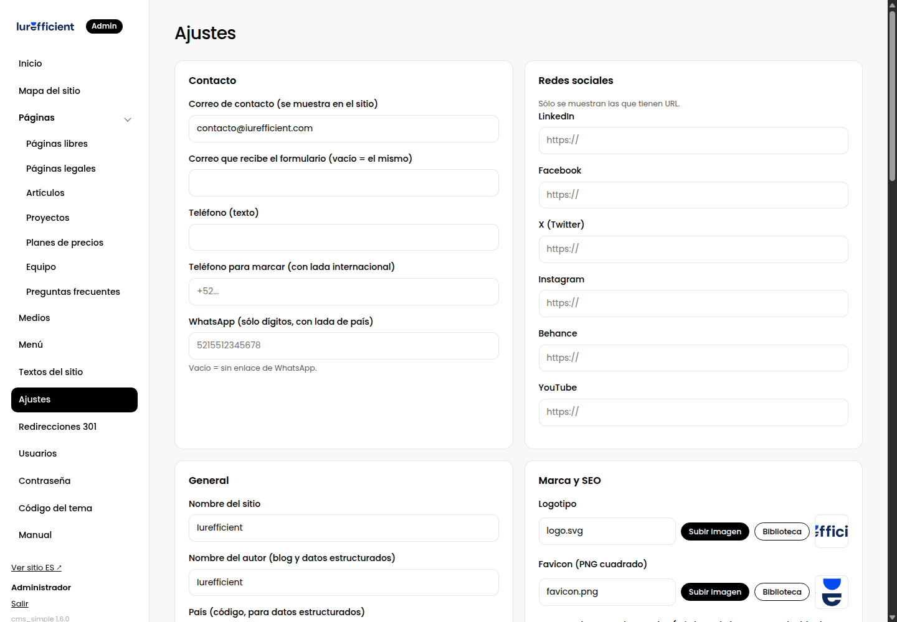
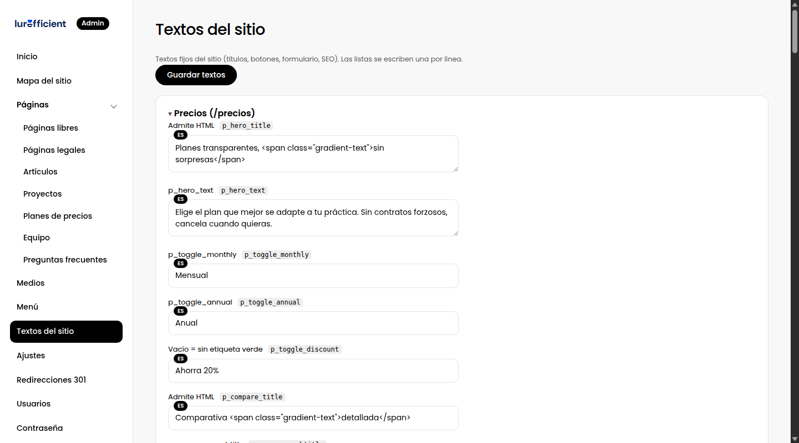
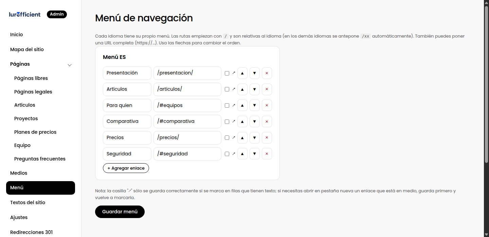

# 2. Tu primer portal desde cero

> Desde subir los archivos hasta tener una portada publicada, en el orden que evita volver atrás.

## Paso 1. Instalar

1. Sube el sitio completo a la carpeta pública del hosting, normalmente `public_html`.
2. Da permiso de escritura a las carpetas `data/` y `uploads/` (755 o 775 en cPanel).
3. Abre `tudominio.com/admin/`. La primera vez te pide crear el usuario administrador. Usa una contraseña larga; no hay recuperación por correo, así que guárdala en un gestor de contraseñas.

Requisitos del servidor: PHP 7.4 o más nuevo y Apache con `mod_rewrite`, que es lo habitual en cPanel.

## Paso 2. Ajustes generales

En **Ajustes** llena, en este orden:

- **Nombre del sitio.** Aparece en los títulos de las pestañas y en los datos que leen los buscadores. Escríbelo con mayúsculas como marca, por ejemplo "Iurefficient", no "iurefficient".
- **Correo de contacto** y a dónde llegan los formularios.
- **Redes sociales.** Solo las que existen; las vacías no se muestran.
- **Logotipo, favicon e imagen para redes.** La imagen para redes es la que sale cuando alguien comparte un enlace en WhatsApp o LinkedIn; ideal 1200 por 630 píxeles.
- **URL canónica**, en la sección SEO: `https://tudominio.com` sin barra final. Evita que el sitio exista "dos veces" con y sin `www`.
- Las secciones propias del sitio, como imágenes de la portada o enlaces de demos, si el tema las define.

## Paso 3. Textos fijos

**Textos del sitio** reúne los textos que no pertenecen a una página: botones del menú, pie de página, mensajes del formulario, títulos y descripciones para buscadores de las páginas fijas. Están agrupados por dónde se usan. Cambia lo que quieras y guarda; el sitio lo refleja de inmediato.

## Paso 4. La portada y las primeras páginas

La portada es una página del constructor como cualquier otra. Ábrela desde el Mapa del sitio, botón Editar en la raíz. Sigue [Construir una página con secciones](cap:04-construir-paginas) para cambiarla o armarla desde cero.

Un orden que funciona para un sitio nuevo:

1. Portada: hero con la promesa principal, tres o cuatro tarjetas con lo que ofreces, prueba social, llamado a la acción.
2. Una página por servicio o producto, colgando de la raíz. Cada una con su propio hero y su cierre con formulario.
3. Una página "Nosotros" o "Equipo".
4. Aviso de privacidad y términos, en Páginas legales.
5. Artículos, cuando tengas los primeros tres. Un blog vacío hace más daño que no tenerlo.

## Paso 5. El menú

En **Menú** decides qué enlaces aparecen en la cabecera. Escribe rutas relativas, como `/precios/`, o URL completas. Desde el Mapa del sitio, el botón ⋯ de cualquier página tiene "Añadir al menú". Regla práctica: cinco o seis enlaces como máximo; lo demás va al pie.

## Paso 6. Antes de anunciar el sitio

- Revisa cada página en el teléfono. El constructor tiene vista previa en móvil.
- Comprueba `tudominio.com/sitemap.xml`: debe listar solo páginas con contenido real.
- Registra el sitio en Google Search Console y en Bing Webmaster Tools, y envíales el sitemap. Está explicado en [SEO](cap:07-seo).
- Haz un respaldo: copia `data/` y `uploads/`. Está explicado en [Mantenimiento](cap:09-mantenimiento).
