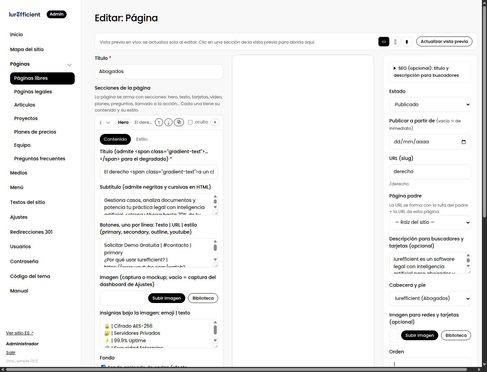

# 4. Construir una página con secciones

> El constructor: añadir secciones, escribir su contenido, ajustar su estilo y publicar con vista previa en vivo.

## La pantalla

Tres columnas:

- **Izquierda**: el título y la lista de secciones. Cada sección es una tarjeta plegable.
- **Centro**: la vista previa en vivo. Es tu sitio real, con su diseño, dibujando lo que estás editando aunque no lo hayas guardado. Se actualiza sola un instante después de cada cambio. Los botones de la barra superior la muestran en escritorio, tableta o móvil.
- **Derecha**: estado, fecha de publicación, URL, página padre, descripción para buscadores, imagen para redes, y el botón Guardar.

Un truco que ahorra tiempo: **haz clic en cualquier sección de la vista previa** y su tarjeta se abre a la izquierda. Y al contrario: al editar una tarjeta, la vista previa la resalta.

## Añadir una sección

Pulsa **Añadir sección**. El selector agrupa los bloques por lo que hacen: cabeceras, contenido, tarjetas y listas, datos del sitio, cierre, y los paquetes de efectos. Cada uno explica en una línea para qué sirve. La sección nueva aparece al final; muévela con las flechas o arrastrándola por el asa ⋮⋮.

Una página bien construida suele tener entre cinco y diez secciones. Si pasa de doce, probablemente son dos páginas.

## Contenido

Cada tarjeta tiene dos pestañas. En **Contenido** están los campos del bloque: títulos, textos, listas, imágenes.

Convenciones que se repiten en todos los bloques:

- **Listas "una por línea"**: cada línea es un elemento. Cuando un elemento tiene varias partes, se separan con una barra vertical: `Título | Texto | icono`. El campo lo explica.
- **Títulos con resalte**: en los títulos puedes envolver una parte en `…` para que salga con el degradado de la marca. Es la única etiqueta que necesitas conocer.
- **Imágenes**: escribe el nombre, súbela con el botón, o elígela de la Biblioteca. Las imágenes se convierten a WebP solas.
- **Textos largos** usan el editor visual, explicado en [Artículos y el editor visual](cap:06-articulos-y-editor).

## Estilo

En **Estilo** están las opciones que el tema permite, iguales para todas las secciones:

| Opción | Para qué |
|---|---|
| Fondo | Un color de la paleta del sitio. La paleta la define el tema, así que todo combina. |
| Color del texto | Claro u oscuro, cuando el fondo lo requiere. Normalmente "automático" acierta. |
| Espacio vertical | Cuánto aire arriba y abajo. |
| Ancho del contenido | Estrecho para texto largo, ancho para galerías, todo el ancho para cintas. |
| Alineación | Izquierda, centro o derecha. |
| Animación al aparecer | Cómo entra la sección al hacer scroll. |
| Efecto | Efectos de los paquetes instalados, como texto revelado letra por letra o fondo animado. |
| Imagen de fondo y oscurecido | Una foto detrás del contenido, con un velo para que el texto se lea. |
| Ancla | El nombre para enlazar a esta sección con `#nombre`, por ejemplo desde un botón. |
| Ocultar en móvil | Para secciones que no aportan en pantallas pequeñas. |

Si una opción no aparece en un bloque es porque ese bloque no la admite; un hero, por ejemplo, controla su propio fondo.

## Herramientas de cada tarjeta

- **↑ ↓** cambian el orden. También puedes arrastrar por el asa.
- **⧉** duplica la sección con todo su contenido. Útil para repetir una estructura cambiando textos.
- **oculta** la guarda sin mostrarla. Sirve para desactivar algo temporalmente sin perderlo.
- **×** la quita. Puedes volver a añadir el bloque, pero el contenido se pierde.

## Publicar

- **Estado**: Borrador o Publicado. Guarda cuantas veces quieras como borrador; nadie lo ve.
- **Vista previa**: en un borrador, el botón "Vista previa" abre el sitio real con un enlace privado que puedes mandar a alguien para que revise.
- **Publicar a partir de**: una fecha futura deja la página lista pero oculta hasta ese día.
- **Versiones anteriores**, al pie de la columna derecha: cada guardado conserva la versión previa. Puedes restaurar cualquiera de las últimas diez.
- **Duplicar**, desde el listado de la colección: crea una copia como borrador para partir de ella.

## Consejos de composición

1. Empieza con un hero que diga en una frase qué es y para quién, y un solo botón principal.
2. Después del hero, responde "¿qué gano?" con tarjetas o un antes y después, no con una lista de funciones.
3. Una prueba: testimonio, cifras, logotipos de clientes.
4. Cierra siempre con un llamado a la acción. La gente que llegó hasta abajo quiere saber qué hacer.
5. Alterna fondos claros y oscuros para que las secciones se distingan al hacer scroll rápido.
