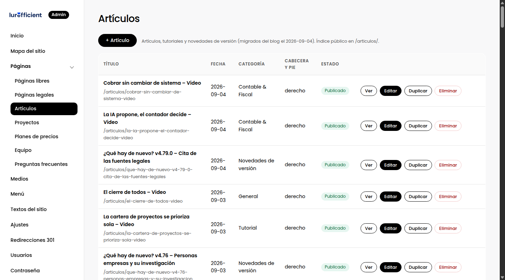
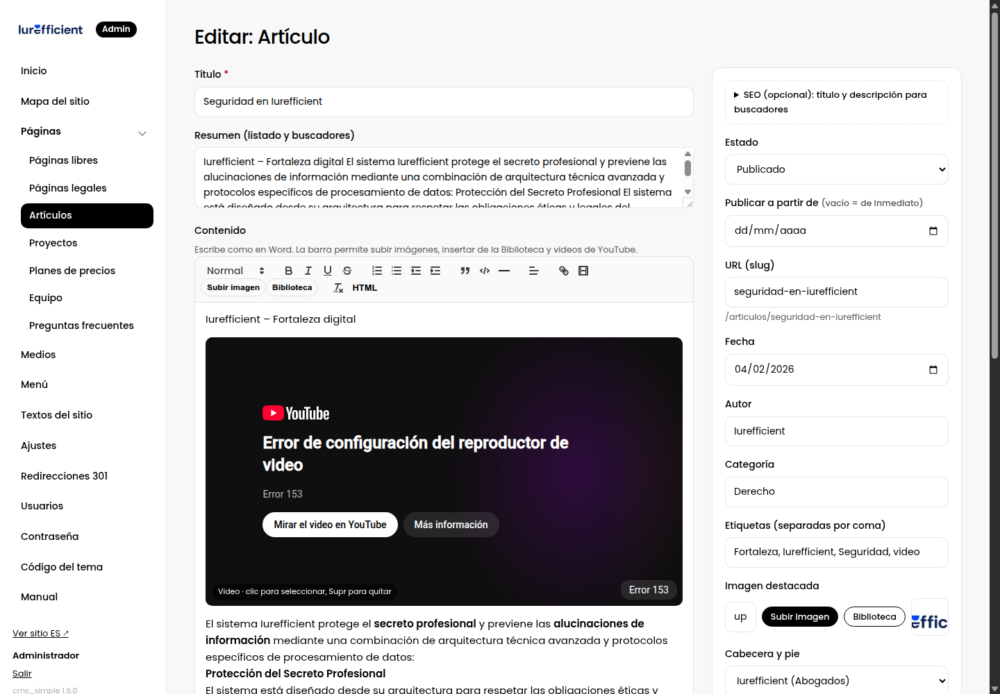
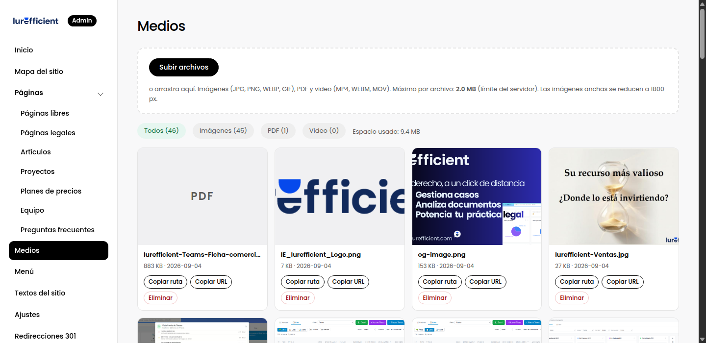

# 6. Artículos y el editor visual

> Escribir artículos, usar la barra del editor, insertar imágenes y videos, y editar el HTML cuando hace falta.

## Colecciones

Artículos, planes, preguntas frecuentes, integrantes del equipo o proyectos son **colecciones**: listas de elementos con los mismos campos. Cada una tiene su listado en el grupo Páginas del menú.

En el listado ves el estado de cada elemento y puedes **Ver** o hacer **Vista previa**, **Editar**, **Duplicar** o **Eliminar**. Eliminar no tiene deshacer; si dudas, pásalo a borrador.

## Precios: dónde se editan

Los planes viven en **Planes de precios**. Hay dos juegos, uno por producto: **Abogados**, que se muestra en la landing
/derecho y en la página /precios, y **Teams**, en la portada. Cada plan es un elemento con precio mensual, precio con pago
anual, etiqueta, características, excedentes y botón. Cambiar un plan lo actualiza en todas las páginas donde aparece.

La tabla comparativa de /precios es una sección de esa página (bloque Tabla comparativa) con una fila por
característica. Los encabezados y precios de las columnas se toman solos de los planes; las filas se escriben a mano,
así que al cambiar un cupo, como usuarios o almacenamiento, cámbialo en la tarjeta del plan y en la fila de la tabla.

## Un artículo

Campos que importan y por qué:

- **Título.** Es lo primero que lee un buscador y lo que se muestra en los resultados. Que diga de qué trata, con las palabras que usaría quien lo busca.
- **Resumen.** Sale en las tarjetas del índice y como descripción en buscadores si no defines otra. Dos frases.
- **Contenido.** El texto, con el editor visual.
- **Fecha, autor, categoría, etiquetas.** La categoría agrupa en el índice; las etiquetas son para filtrar.
- **Imagen destacada.** Aparece en las tarjetas y al compartir el enlace. Horizontal, mínimo 1200 píxeles de ancho.
- **Cabecera y pie**, si el sitio tiene varias marcas.
- **SEO opcional**: un título distinto para buscadores, y una descripción a medida. Si no los llenas, se usan el título y el resumen.

## La barra del editor

- **Normal / Título 1 a 4.** Usa Título 2 para las secciones del artículo y Título 3 para subsecciones. No uses Título 1: ese es el título del artículo.
- **Negritas, cursivas, subrayado, tachado.**
- **Listas** numeradas y con viñetas, con sangría.
- **Cita** para destacar una frase; en las páginas legales se dibuja como recuadro.
- **Bloque de código** para fragmentos técnicos.
- **Línea horizontal** para separar partes.
- **Alineación.**
- **Enlace.** Selecciona el texto y pega la dirección.
- **Video.** Pega la URL de YouTube o Vimeo; se inserta a todo el ancho. Para quitarlo, haz clic sobre él y pulsa Supr.
- **Subir imagen** y **Biblioteca**, para imágenes, PDF o videos ya subidos.
- **Quitar formato**, cuando pegas texto de Word y llega con estilos raros.
- **HTML.** Abre el código de lo que estás escribiendo, con colores y números de línea. Lo que edites ahí se guarda tal cual. Es la salida para tablas, incrustados o cualquier cosa que el editor visual no entiende. Al volver al modo visual, el editor reinterpreta el código y puede simplificar lo que no reconoce.

## Imágenes

- Súbelas ya recortadas; el sistema las convierte a WebP y ajusta el tamaño máximo, pero no las recorta.
- Pon un **texto alternativo** cuando la imagen aporta información. Los buscadores lo leen, y las personas con lector de pantalla también.
- Nombra los archivos con palabras, `panel-de-casos.png` en lugar de `IMG_2041.png`. El nombre cuenta para las búsquedas de imágenes.

## Medios

**Medios** es la biblioteca de todo lo subido. Desde ahí copias rutas, subes por lotes arrastrando, o borras. El panel avisa si un archivo está en uso antes de borrarlo.

## Publicar y programar

Igual que en las páginas: borrador, publicado, publicación programada, vista previa con enlace privado y versiones anteriores. Un artículo publicado entra al sitemap y al índice de artículos de forma automática.
